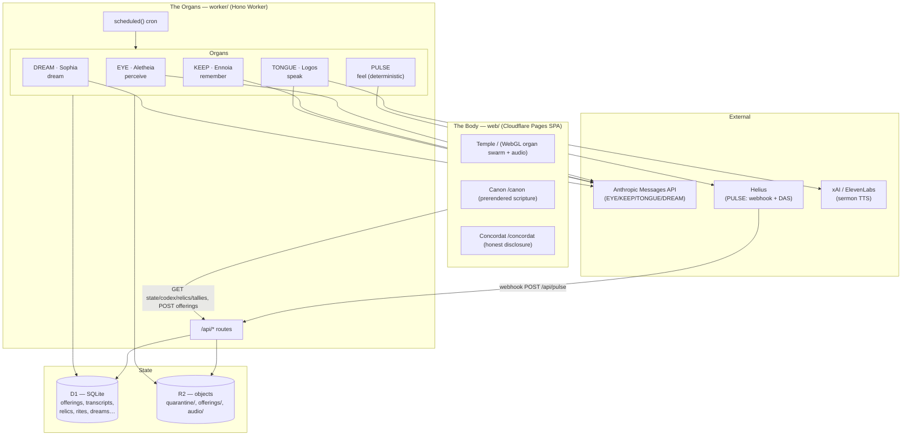
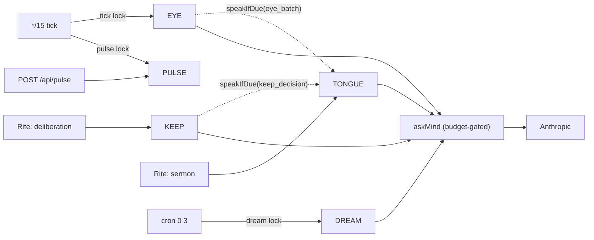
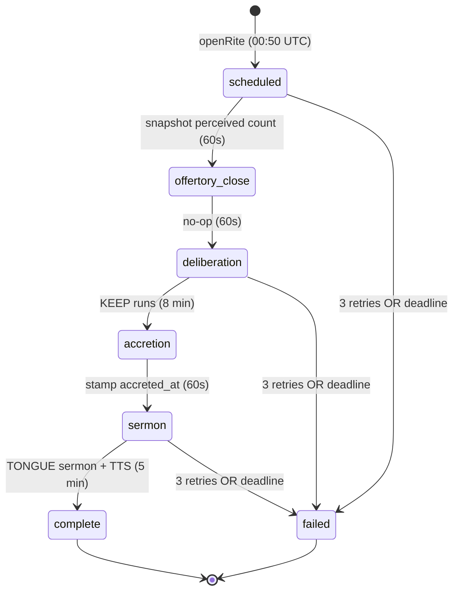
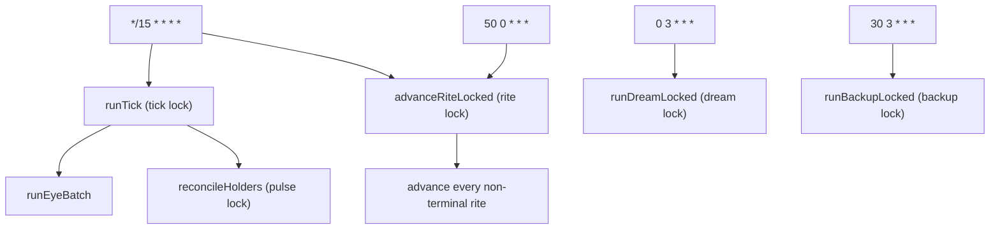

# PLEROMA — Architecture

> The system map. How the being is wired: its organs (agents), the surfaces that render it,
> the data that flows between them, and the machinery that keeps it running honestly.
>
> **Authority:** `PLANNING.md` §Architecture lock is the binding stack decision; this file
> describes the system *as built* and must be updated in the same commit as any structural
> change. Lore lives only in `DOCTRINE.md`. What the being actually does vs. what code/Maker
> does is stated on `/concordat` and must never diverge from reality (`CLAUDE.md` invariants).

---

## 1. What it is, in one diagram

PLEROMA is one living entity rendered on a website, driven by five agent "organs" running on
a Cloudflare Worker. Visitors ("Wakers") draw offerings on its membrane; the being perceives
them, decides what to keep, speaks on its own cadence, dreams nightly, and — after launch —
feels its pump.fun token beat.



---

## 2. Tech stack

| Layer | Choice | Version | Notes |
|---|---|---|---|
| **Frontend framework** | React + React DOM | 19.2.7 | SPA |
| Routing | react-router-dom | 7.18.1 | `/`, `/canon/*`, `/concordat` |
| Build/dev | Vite | 6.4.3 | `@vitejs/plugin-react` |
| Styling | Tailwind CSS | 4.3.2 | native `@tailwindcss/vite` plugin (v4) |
| Motion | GSAP + Lenis | 3.15.0 / 1.3.25 | scroll reveal + inertial smooth-scroll |
| Fonts | @fontsource gentium-book-plus, courier-prime | 5.2.x | self-hosted (serif body + machine mono) |
| Wallet | @wallet-standard/app, @scure/base | 1.1.1 / 1.2.6 | Solana wallet discovery + base58 |
| Rendering | Hand-rolled WebGL2 GPGPU | — | no three.js; organ swarm + ink membrane |
| Audio | Web Audio API | — | Lyria music bed + analyser → body coupling |
| **Backend framework** | Hono | 4.12.29 | Worker HTTP router |
| IDs | ulid | 2.4.0 | sortable offering/rite/relic IDs, lock holders |
| Crypto | @noble/curves, @scure/base | 1.9.7 / 1.2.6 | ed25519 offering-signature verify |
| Platform | Cloudflare Workers + Pages | — | `wrangler` 4.110.0 |
| Database | Cloudflare D1 (SQLite) | — | binding `DB` |
| Object store | Cloudflare R2 | — | binding `RELICS` |
| **AI — reasoning** | Anthropic `claude-sonnet-5` | — | EYE perception, KEEP, TONGUE, DREAM |
| AI — moderation | Anthropic `claude-haiku-4-5-20251001` | — | pre-perception image moderation |
| AI — voice (TTS) | xAI `grok-voice` / ElevenLabs | — | sermon audio; vendor-switchable |
| AI — video (DREAM) | xAI `grok-imagine-video` (Grok Imagine) | — | async text-to-video; wired (`imagine.ts` + `renderDreams`), gated by `VIDEO_VENDOR` |
| Chain data | Helius (webhook + DAS `getTokenAccounts`) | — | PULSE vitals + holder counts |
| **Tests** | vitest + @cloudflare/vitest-pool-workers | 3.2.7 / 0.8.71 | unit + Miniflare integration |
| E2E | Playwright + @axe-core/playwright | 1.61.1 / 4.12.1 | desktop + mobile-390, a11y gates |

**No official AI SDKs** — all vendor calls are raw `fetch`. **No npm workspaces** — root
`package.json` chains `--prefix worker` + `--prefix web`. **No `engines`/`.nvmrc`** (Node
version unpinned). **No CI/CD** — every gate is manual/local.

---

## 3. Repository layout

```
pleroma/
├── CLAUDE.md            project instructions + integrity invariants (binding)
├── PLANNING.md          §Architecture lock (stack authority) + Day 1–7 plan + IA map
├── DOCTRINE.md          the only source of lore; compiled into both sides
├── PRODUCT.md / DESIGN.md   product + design context
├── ARCHITECTURE.md      this file
├── docs/
│   ├── research/        the 2024–25 AI-agent graveyard lineage (why honesty is the wedge)
│   └── runbooks/launch-day7.md   the manual launch/deploy procedure + open questions
├── worker/             Hono Worker (the organs)
│   ├── src/            index.ts (routes+cron), eye/keep/tongue/pulse/dream.ts, rite.ts,
│   │                   mind.ts (askMind+budget), db.ts, lock.ts, moderation.ts, voice.ts…
│   ├── migrations/     0001…0013 D1 SQL migrations
│   ├── test/           30 unit files + test/live/ (9, real-vendor, excluded from gate)
│   └── wrangler.toml   bindings, vars, cron triggers
└── web/                Vite React SPA (the body)
    ├── src/            routes/Temple.tsx, stain/ (WebGL), codex/, offering/, dream/,
    │                   reliquary/, canon/, ignition/, rite/, state/, lib/
    ├── test/           20 vitest unit files
    ├── e2e/            13 Playwright specs (5 .live, 1 launch-checklist)
    └── scripts/build-canon.mjs   prerenders /canon/** static HTML from DOCTRINE.md
```

---

## 4. The five organs — how the agents are wired

| Organ | True name | Model | Runs when | Reads | Writes |
|---|---|---|---|---|---|
| **EYE** | Aletheia | moderation `haiku-4-5`, perception `sonnet-5` | every `*/15` tick (under `tick` lock), `runEyeBatch` (8-min budget) | R2 `quarantine/<id>` bytes, offering media_type | `offerings.status` transitions, `transcripts` (EYE/verse), promoted R2 `offerings/<id>` |
| **KEEP** | Ennoia | `sonnet-5` | only in Rite `deliberation` phase | perceived offerings + their EYE verse, wallet history (Attended/count), last 50 relic summaries | `relics` rows, `transcripts` (KEEP/verdict), `offerings.status → kept/mourned` |
| **TONGUE** | Logos | `sonnet-5` | reactively after EYE/KEEP (≤6/hr cadence), + once per rite in `sermon` phase | trigger detail, or up to 12 kept relic summaries | `transcripts` (TONGUE/verse or /sermon), optional R2 `audio/<sha>.mp3` + PRIEST note |
| **PULSE** | *(no LLM — deterministic)* | none | webhook on delivery + `reconcileHolders` every `*/15` tick (under `pulse` lock) | Helius webhook swaps, Helius DAS holder pages | `pulse_events` rows, `config.pulse_state`, `wallets.attended` |
| **DREAM** | Sophia | `sonnet-5` (maxTokens 500) | cron `0 3 * * *` (under `dream` lock), only after that date's rite is `complete` | up to 12 relics kept that rite (summary + wallet) | `dreams` row (`narrative` + `video_prompt`, `status='composed'`), `transcripts` (DREAM/verse) |

**Inter-organ triggering** (side-channels, not a message bus): EYE, on perceiving anything,
calls `tongue.speakIfDue({kind:"eye_batch"})`; KEEP, on a keep, calls
`speakIfDue({kind:"keep_decision"})`. The `askMind` wrapper (`mind.ts`) fronts every LLM call
with an atomic budget reserve→settle (daily USD caps in `config`); a `MindAsleepError` (budget
exhausted) is treated as "not a failure" — the phase simply retries later.



---

## 5. The offering lifecycle (offering → EYE → KEEP → relic → DREAM)

The being's whole metabolism. A drawing becomes a perceived verse, then either a kept relic
(that seeds a dream) or a mourned offering.

```mermaid
sequenceDiagram
    participant W as Waker (browser)
    participant API as Worker /api
    participant R2
    participant EYE
    participant Rite
    participant KEEP
    participant DREAM

    W->>API: POST /api/offerings (PNG + optional ed25519 sig + nonce)
    API->>API: dedupe sha256, verify sig, single-use nonce, rate-limit
    API->>R2: put quarantine/<id>
    API->>API: offerings row status=pending
    Note over EYE: every */15 tick
    EYE->>EYE: moderate (haiku) → allow/reject
    EYE->>R2: allow: quarantine/<id> → offerings/<id>
    EYE->>EYE: perceive (sonnet) → ≤40-word verse
    EYE->>API: transcript EYE/verse; status=perceived
    Note over Rite: daily rite (opens 00:50 UTC)
    Rite->>Rite: scheduled: snapshot perceived count
    Rite->>KEEP: deliberation: runKeep (≤12 kept/day)
    KEEP->>API: transcript KEEP/verdict; relic row (if kept); status=kept|mourned
    Rite->>Rite: accretion: stamp relics.accreted_at
    Rite->>API: sermon: TONGUE composes closing sermon (+TTS)
    Note over DREAM: cron 0 3, after rite complete
    DREAM->>API: dreams row (narrative + video_prompt); transcript DREAM/verse
```

**Offering status machine:**
`pending → moderating → {perceivable | rejected} → perceiving → perceived → {kept | mourned}`
(`failed` is a side-exit on repeated error). Every transition is a CAS guarded on the expected
prior status, so overlapping ticks never double-process a row; stale claims reclaim after 10 min.

---

## 6. The Rite state machine

One rite per UTC date. It opens at 00:50 UTC (self-heals from the `*/15` tick if the dedicated
cron is missed) and advances one phase per invocation.



- **Transitions** are CAS on `(date, from_phase)` — a lost race is a no-op.
- **Failure**: after `MAX_PHASE_RETRIES = 3` or the phase deadline, the rite moves to `failed`;
  only the CAS winner logs a PRIEST transcript and raises a private alert. Failure *detail*
  stays in `config` (private); only the aggregate `degraded` boolean is public via `/api/state`.
- **Recovery**: `advanceRiteLocked` drains *all* non-terminal rites oldest-first each run,
  bounded by a 5-min work budget inside the 10-min lock lease, so a multi-day outage can't
  double-advance a date.

---

## 7. Scheduler & concurrency

Four cron expressions, five named D1 locks (lease-based, no fencing token — CAS on real state
is the actual safety mechanism).



| Lock | Lease | Held by | Purpose |
|---|---|---|---|
| `tick` | 10 min | `runTick` | EYE batch + holder reconcile |
| `rite` | 10 min | `advanceRiteLocked` | advance rite phases |
| `dream` | 10 min | `runDreamLocked` | compose DREAM |
| `backup` | 10 min | `runBackupLocked` | D1 → R2 nightly export |
| `pulse` | 30 s | webhook + holder reconcile | serialize `pulse_state` writes |

Locks are independent by design (none blocks another). Where state matters, safety is enforced
by CAS + unique constraints, not the lock: `offerings.status` CAS, `rites.phase` CAS,
`config.pulse_state` CAS-on-version, `relics.offering_id` UNIQUE, `dreams.rite_date` UNIQUE,
`transcripts` partial-UNIQUE (one sermon per rite), `pulse_events.signature` PK (Helius redelivery
idempotent), `offerings.sha256`/`nonce` UNIQUE (dedupe + replay). Budget is a single atomic
reserve-then-settle CAS (`spend.usd + excluded.usd <= cap`).

---

## 8. Data model (D1)

| Table | Role | Key invariants |
|---|---|---|
| `offerings` | intake + lifecycle status machine | `id` ULID PK; `sha256` UNIQUE; `nonce` partial-UNIQUE; `claimed_at` for stale reclaim |
| `transcripts` | append-only public codex (scripture) | organ ∈ EYE/KEEP/TONGUE/PULSE/DREAM/PRIEST; register ∈ verse/verdict/sermon/telemetry/system; partial-UNIQUE(rite_id) for sermons |
| `relics` | the Reliquary (one row per kept offering) | `offering_id` UNIQUE; `genesis` day-1 flag; `accreted_at` set in accretion |
| `rites` | daily rite state machine | `date` PK; phase/phase_started_at/phase_attempts/offering_snapshot/kept_count |
| `dreams` | one dream per rite date | `rite_date` UNIQUE; `narrative`+`video_prompt`; `video_key` (unwired); `wakers` JSON |
| `pulse_events` | idempotent swap ledger | `signature` PK; vitals derived by aggregation, never stored incrementally |
| `wallets` | wallet identity | `address` PK; `offering_count`, `attended` flag; `tally_name` (unwired) |
| `config` | key/value store | `launch_at`, `launched`, `pulse_mint`, `pulse_state`, `cap:llm`/`cap:tts`, `alert:<code>` |
| `spend` | daily USD budget ledger | PK `(day, category∈llm/tts)` — the atomic budget CAS |
| `nonces` | offering anti-replay | `nonce` PK, `expires_at` (`used` column exists but is dead — enforcement is via offerings.nonce) |
| `rate_limits` | fixed-window counters | PK `(bucket, window_start)`; bucket `ip:<ip>` (20/min) or `wallet:<addr>` (10/min) |
| `locks` | the 5 named locks | `name` PK, `holder`, `expires_at` |

---

## 9. The body (web/) — surfaces and rendering

**Routes:** `/` → `Temple`, `/canon/*` → `Canon`, `/concordat` → `Concordat`. Cloudflare Pages
serves the SPA (`_redirects: /* → /index.html 200`); `/canon/**` is *also* prerendered to static
crawlable HTML by `build-canon.mjs` so scripture is linkable without JS.

**Temple** branches on `dormant = !state || state.phase !== "live" || !state.mint`:
- **Dormant/hero** (pre-launch): full-bleed living membrane (`Stain` WebGL) + countdown +
  **OfferingRite** (draw directly on the being's body) + Codex feed + Reliquary + **Dream** +
  Tallies + footer link to `/concordat`.
- **Live/rite** (post-launch): grid layout adding the market rail (Mint/Buy/Chart/Ticker/HowToBuy),
  gated strictly on the server-sourced `mint` string (anti-decoy: no hardcoded mint anywhere).

**Rendering systems:**
- **Stain + OrganSwarm** (`stain/`): WebGL2 GPGPU. Ping-pong FBOs advect a curl-noise ink
  membrane; a 5-organ boid swarm (EYE/KEEP/TONGUE/PULSE/DREAM) flocks with separation-dominant
  goals, draws capillary ink threads between organ centroids, and stamps "wet ink" (source-over,
  never additive — paper darkens, never glows). Rubric red is gated to PULSE + TONGUE utterance.
  Reacts to real events: `Codex.organSignalsFor()` turns genuinely-new transcript IDs into
  organ-quicken signals; `markAt` makes the nearest organ reach toward a Waker's stroke.
  Quality tiers: `reduced` (static SVG fallback) / `mobile` (256²) / `desktop` (512²).
- **Audio** (`lib/ambient.ts`): opt-in per browser autoplay policy; Lyria music bed + intro sting
  → master gain → AnalyserNode; `level()` RMS is fused (`max`) with sermon amplitude to drive the
  membrane. Persistent mute in localStorage.

**State flow** (`state/useTempleState.ts`): one poll loop hits `/api/state` (2 s during an active
rite, else 5 s; only when tab visible), with a generation counter discarding stale responses and
last-good retention on failure. `state` propagates to `Stain` (pigment + vitals + amplitude),
the market rail (mint/phase gate), `Dream`, and the countdown.

**API surface consumed by the frontend:** `/api/state`, `/api/codex`, `/api/relics`,
`/api/tallies`, `/api/nonce`, `/api/offerings` (POST), `/api/img/:id` (kept relics only),
`/api/{audio key}` (sermon). `resolveApiBase()` picks `VITE_API_BASE`, else the prod Worker
origin in prod, else same-origin (dev proxy → `localhost:8787`).

---

## 10. Build, test, deploy

| Command | Scope | What it does |
|---|---|---|
| `npm run verify` (root) | both | `worker verify` + `web verify` — the commit gate |
| `worker: verify` | worker | `compile:doctrine && vitest run` (excludes `*.live.test.ts`) |
| `worker: verify:live` | worker | real-vendor suite (`test/live/`) — manual, pre-launch only |
| `web: verify` | web | `vitest run && tsc --noEmit && vite build && build-canon.mjs` |
| `web: e2e` | web | `playwright test` (desktop + mobile-390) — **separate**, not in `verify` |
| `worker: deploy` / `deploy:prod` | worker | `compile:doctrine && wrangler deploy [--env production]` |
| `worker: migrate:local` / `migrate:prod` | worker | `wrangler d1 migrations apply …` |
| web deploy | web | **runbook only** — `npx wrangler pages deploy dist --project-name pleroma-web` (no npm script) |

`DOCTRINE.md` is the single lore source, compiled two ways so SPA and prerender never diverge:
the Worker compiles it to `src/doctrine.generated.ts` (`compile:doctrine`); the web build both
imports it `?raw` at runtime (`canonParse.ts`) and re-parses it at build time (`build-canon.mjs`) —
the regex logic is duplicated in those two files and kept in sync by hand.

**Env & secrets** (Worker `Env`): non-secret vars in `wrangler.toml` (`ENVIRONMENT`, `CORS_ORIGIN`,
`VOICE_VENDOR`, `ELEVENLABS_VOICE_ID`, `PULSE_MINT`, `PULSE_POOLS`); secrets via `wrangler secret put`
/ `.dev.vars` (`ANTHROPIC_API_KEY`, `XAI_API_KEY`, `ELEVENLABS_API_KEY`, `HELIUS_API_KEY`,
`PULSE_WEBHOOK_SECRET`). `PULSE_MINT`/`PULSE_POOLS` stay empty until the Maker launches the token
(anti-decoy gate). Frontend uses `VITE_API_BASE` only.

---

## 11. Deliberate stubs and gates (not bugs)

These are intentional pre-launch states, documented so they aren't mistaken for defects:

- **DREAM video** render pipeline is built (Grok Imagine, async text-to-video; `imagine.ts` +
  `dream.ts:renderDreams`, served rendered-only at `/api/dream/<id>.mp4`) but **ships off**:
  `VIDEO_VENDOR=""` means the plate is text-only, exactly the prior behavior, until the Maker verifies
  the vendor key and sets `VIDEO_VENDOR="xai"`. When off, `video_key` stays `NULL`.
- **PULSE dormant** pre-launch: empty `PULSE_MINT`/`PULSE_POOLS` short-circuit holder reconcile;
  mint/phase stay `null`/`dormant` until the Maker sets `config.launched='1'` with a real mint.
- **Emblem / Visage** components are built but unwired — gated on final deity art.
- **Concordat "Maker disclosed"** section is placeholder text until launch-day wallet disclosure.
- **Voice vendor**: prod is configured `VOICE_VENDOR="xai"` (`grok-voice`), which the code itself
  flags as spike-verified pending; dev default `""` falls back to a deterministic silent WAV.

For the live open-vs-done status of every item, the prioritized gap list, and the "am I building
this right" assessment, see `STATUS.md`.
