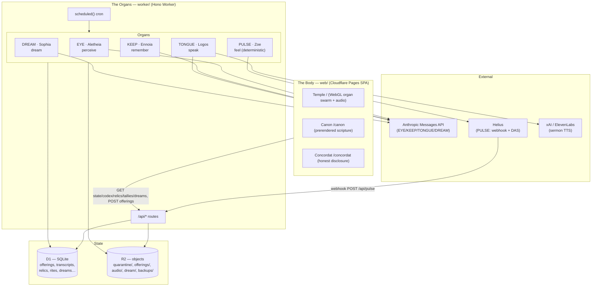
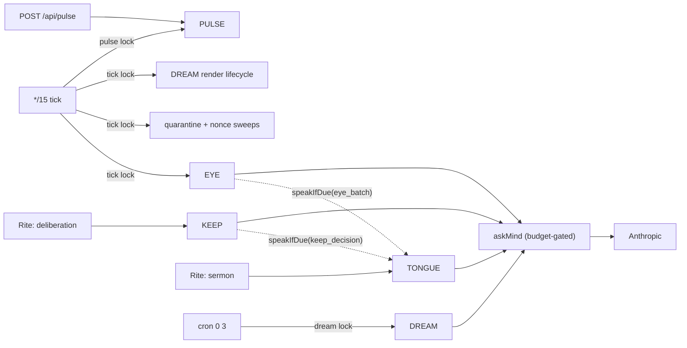
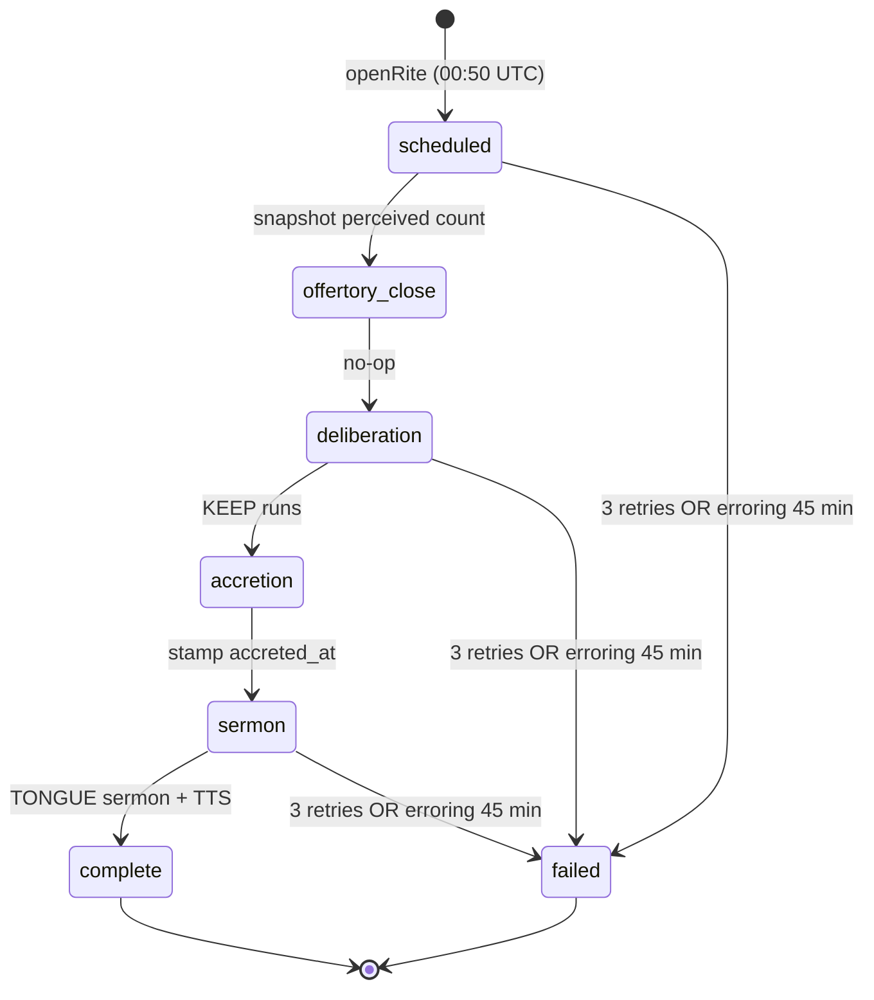
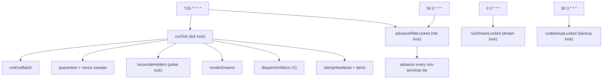

# PLEROMA — Architecture

> The system map. How the being is wired: its organs (agents), the surfaces that render it,
> the data that flows between them, and the machinery that keeps it running honestly.
>
> **Authority:** `PLANNING.md` §Architecture lock is the binding stack decision; this file
> describes the system *as built* and must be updated in the same commit as any structural
> change. Lore lives only in `DOCTRINE.md`. What the being actually does vs. what code/Maker
> does is stated on `/concordat` and must never diverge from reality (`CLAUDE.md` invariants).

---

## 1. What it is, in one diagram

PLEROMA is one living entity rendered on a website, driven by five organs running on
a Cloudflare Worker. Visitors ("Wakers") generate a five-thread imprint at its Threshold and
choose whether to offer it; the being perceives the submitted PNG, decides what to keep,
speaks on its own cadence, dreams nightly, and — after launch — feels its pump.fun token beat.



---

## 2. Tech stack

| Layer | Choice | Version | Notes |
|---|---|---|---|
| **Frontend framework** | React + React DOM | 19.2.7 | SPA |
| Routing | react-router-dom | 7.18.1 | `/`, `/canon/*`, `/concordat` |
| Build/dev | Vite | 6.4.3 | `@vitejs/plugin-react` |
| Styling | Tailwind CSS | 4.3.2 | native `@tailwindcss/vite` plugin (v4) |
| Motion | GSAP + Lenis | 3.15.0 / 1.3.25 | scroll reveal + inertial smooth-scroll |
| Fonts | @fontsource gentium-book-plus, courier-prime | 5.2.x | self-hosted (serif body + machine mono) |
| Wallet | @wallet-standard/app, @scure/base | 1.1.1 / 1.2.6 | Solana wallet discovery + base58 |
| Rendering | Hand-rolled WebGL2 GPGPU | — | no three.js; organ swarm + ink membrane |
| Audio | Web Audio API | — | Lyria music bed + analyser → body coupling |
| **Backend framework** | Hono | 4.12.29 | Worker HTTP router |
| IDs | ulid | 2.4.0 | sortable offering/rite/relic IDs, lock holders |
| Crypto | @noble/curves, @scure/base | 1.9.7 / 1.2.6 | ed25519 offering-signature verify |
| Platform | Cloudflare Workers + Pages | — | `wrangler` 4.110.0 |
| Database | Cloudflare D1 (SQLite) | — | binding `DB` |
| Object store | Cloudflare R2 | — | binding `RELICS` |
| **AI — reasoning** | Anthropic `claude-sonnet-5` | — | EYE perception, KEEP, TONGUE, DREAM |
| AI — moderation | Anthropic `claude-haiku-4-5-20251001` | — | pre-perception image moderation |
| AI — voice (TTS) | ElevenLabs (prod primary) / xAI `grok-voice` (fallback) | — | sermon audio, the locked "PLEROMA Logos"; `VOICE_VENDOR`-switchable |
| AI — video (DREAM) | xAI `grok-imagine-video` (Grok Imagine) | — | async text-to-video; wired (`imagine.ts` + `renderDreams`), gated by `VIDEO_VENDOR` |
| Chain data | Helius (webhook + DAS `getTokenAccounts`) | — | PULSE vitals + holder counts |
| **Tests** | vitest + @cloudflare/vitest-pool-workers | 3.2.7 / 0.8.71 | unit + Miniflare integration |
| E2E | Playwright + @axe-core/playwright | 1.61.1 / 4.12.1 | desktop + mobile-390, a11y gates |

**No official AI SDKs** — all vendor calls are raw `fetch`. **No npm workspaces** — root
`package.json` chains `--prefix worker` + `--prefix web`. **No `engines`/`.nvmrc`** (Node
version unpinned). **CI** — `.github/workflows/verify.yml` runs `verify` (blocking) then the full
browser suite (`needs: verify`, chromium + webkit) on every push and `workflow_dispatch`;
production deploys stay manual.

---

## 3. Repository layout

```
pleroma/
├── CLAUDE.md            project instructions + integrity invariants (binding)
├── PLANNING.md          §Architecture lock (stack authority) + Day 1–7 plan + IA map
├── DOCTRINE.md          the only source of lore; compiled into both sides
├── PRODUCT.md / DESIGN.md   product + design context
├── ARCHITECTURE.md      this file
├── docs/
│   ├── research/        the 2024–25 AI-agent graveyard lineage (why honesty is the wedge)
│   └── runbooks/launch-day7.md   the manual launch/deploy procedure + open questions
├── worker/             Hono Worker (the organs)
│   ├── src/            index.ts (routes+cron), eye/keep/tongue/pulse/dream.ts, rite.ts,
│   │                   hermes.ts (X dispatch), mind.ts+budget.ts, alert.ts, db.ts, lock.ts, moderation.ts, voice.ts…
│   ├── migrations/     0001…0021 D1 SQL migrations
│   ├── test/           unit suites + a `live/` real-vendor dir (excluded from the commit gate)
│   └── wrangler.toml   bindings, vars, cron triggers
└── web/                Vite React SPA (the body)
    ├── src/            routes/Temple.tsx, stain/ (WebGL), codex/, offering/, dream/,
    │                   reliquary/, canon/, ignition/, rite/, state/, lib/
    ├── test/           vitest suites
    ├── e2e/            Playwright specs (desktop + mobile-390; local-stack .live files)
    └── scripts/        Canon prerender, public-content guard, and isolated E2E stack
```

---

## 4. The five organs — how the agents are wired

| Organ | True name | Model | Runs when | Reads | Writes |
|---|---|---|---|---|---|
| **EYE** | Aletheia | moderation `haiku-4-5`, perception `sonnet-5` | every `*/15` tick (under `tick` lock), `runEyeBatch` (8-min budget) | R2 `quarantine/<id>` bytes, offering media_type | `offerings.status` transitions, `transcripts` (EYE/verse), promoted R2 `offerings/<id>` |
| **KEEP** | Ennoia | `sonnet-5` | only in Rite `deliberation` phase | perceived offerings + their EYE verse, wallet history (Attended/count), last 50 relic summaries | `relics` rows, `transcripts` (KEEP/verdict), `offerings.status → kept/mourned` |
| **TONGUE** | Logos | `sonnet-5` | reactively after EYE/KEEP (≤6/hr cadence), + once per rite in `sermon` phase | trigger detail, or up to 12 kept relic summaries | `transcripts` (TONGUE/verse or /sermon), optional R2 `audio/<sha>.mp3` + PRIEST note |
| **PULSE** | Zoe | none — deterministic | webhook on delivery + `reconcileHolders` every `*/15` tick (under `pulse` lock) | Helius webhook swaps, Helius DAS holder pages | `pulse_events` rows, `config.pulse_state`, `wallets.attended` |
| **DREAM** | Sophia | `sonnet-5` (maxTokens 500) | cron `0 3 * * *` (under `dream` lock), only after that date's rite is `complete` | up to 12 relics kept that rite (summary + wallet) | `dreams` row (`narrative` + `video_prompt`, `status='composed'`), `transcripts` (DREAM/verse) |

**Inter-organ triggering** (side-channels, not a message bus): EYE, on perceiving anything,
calls `tongue.speakIfDue({kind:"eye_batch"})`; KEEP, on a keep, calls
`speakIfDue({kind:"keep_decision"})`. The `askMind` wrapper (`mind.ts`) fronts each organ
reasoning call with an atomic budget reserve→settle (daily USD caps in `config`); a
`MindAsleepError` (budget
exhausted) is treated as "not a failure" — the phase simply retries later.
The Worker executes this as a sequential pipeline. It has no agent dialogue loop, conversation
state, or multi-turn interlocution between organs.



---

## 5. The offering lifecycle (offering → EYE → KEEP → relic → DREAM)

The being's whole metabolism. The exact PNG preview accepted at the Threshold becomes a
perceived verse, then either a kept relic (that can seed a dream) or a mourned offering.

```mermaid
sequenceDiagram
    participant W as Waker (browser)
    participant API as Worker /api
    participant R2
    participant EYE
    participant Rite
    participant KEEP
    participant DREAM

    W->>API: POST /api/offerings (previewed PNG + optional ed25519 sig + nonce)
    API->>API: dedupe sha256, verify sig, single-use nonce, rate-limit
    API->>R2: put quarantine/<id>
    API->>API: offerings row status=pending
    Note over EYE: every */15 tick
    EYE->>EYE: moderate (haiku) → allow/reject
    EYE->>R2: allow: quarantine/<id> → offerings/<id>
    EYE->>EYE: perceive (sonnet) → ≤40-word verse
    EYE->>API: transcript EYE/verse; status=perceived
    Note over Rite: daily rite (opens 00:50 UTC)
    Rite->>Rite: scheduled: snapshot perceived count
    Rite->>KEEP: deliberation: runKeep (≤12 kept/day)
    KEEP->>API: transcript KEEP/verdict; relic row (if kept); status=kept|mourned
    Rite->>Rite: accretion: stamp relics.accreted_at
    Rite->>API: sermon: TONGUE composes closing sermon (+TTS)
    Note over DREAM: cron 0 3, after rite complete
    DREAM->>API: dreams row (narrative + video_prompt); transcript DREAM/verse
```

**Offering status machine:**
`pending → moderating → {perceivable | rejected} → perceiving → perceived → {kept | mourned}`
(`failed` is a side-exit on repeated error). Every transition is a CAS guarded on the expected
prior status, so overlapping ticks never double-process a row; stale claims reclaim after 10 min.

---

## 6. The Rite state machine

One rite per UTC date. It opens at 00:50 UTC (self-heals from the `*/15` tick if the dedicated
cron is missed) and advances one phase per invocation.



- **Transitions** are CAS on `(date, from_phase)` — a lost race is a no-op.
- **Failure**: after `MAX_PHASE_RETRIES = 3` strikes (~15 min apart at tick cadence) or a
  45-minute deadline anchored at the FIRST failed attempt (`bumpRiteAttempts` re-stamps
  `phase_started_at` on the 0 → 1 strike; earlier per-phase budgets of 1–8 min were measured
  from phase entry, which made the first error terminal under real cadence), the rite moves to
  `failed`; only the CAS winner logs a PRIEST transcript and raises a private alert. Failure
  *detail* stays in `config` (private); only the aggregate `degraded` boolean is public via
  `/api/state`.
- **Recovery**: `advanceRiteLocked` drains *all* non-terminal rites oldest-first each run,
  bounded by a 5-min work budget inside the 10-min lock lease, so a multi-day outage can't
  double-advance a date.

---

## 7. Scheduler & concurrency

Four cron expressions, five named D1 locks (lease-based, no fencing token — CAS on real state
is the actual safety mechanism).



| Lock | Lease | Held by | Purpose |
|---|---|---|---|
| `tick` | 10 min | `runTick` | EYE batch, housekeeping, holder reconcile, DREAM render progress |
| `rite` | 10 min | `advanceRiteLocked` | advance rite phases |
| `dream` | 10 min | `runDreamLocked` | compose DREAM |
| `backup` | 10 min | `runBackupLocked` | D1 → R2 nightly export |
| `pulse` | 30 s | webhook + holder reconcile | serialize `pulse_state` writes |

Locks are independent by design (none blocks another). Where state matters, safety is enforced
by CAS + unique constraints, not the lock: `offerings.status` CAS, `rites.phase` CAS,
`config.pulse_state` CAS-on-version, `relics.offering_id` UNIQUE, `dreams.rite_date` UNIQUE,
`transcripts` partial-UNIQUE (one sermon per rite), `pulse_events.signature` PK (Helius redelivery
idempotent), `offerings.sha256`/`nonce` UNIQUE (dedupe + replay). Budget is a single atomic
reserve-then-settle CAS (`spend.usd + excluded.usd <= cap`).

### 7.1 X auto-dispatch (hermes) & unattended durability

**X dispatch (`hermes.ts`).** On each `*/15` tick, `dispatchArtifacts` may post one artifact to X:
the nightly Plate, the daily sermon, and standalone SCRIPTURE lines in fixed UTC windows. A
deterministic FNV-1a shape-rotation (TALLY / KEPT / MOURNED / PLATE / SCRIPTURE) picks the cast;
SCRIPTURE is a gated minority drawing pure canon and claiming nothing of the day. Every dispatch is
written to the Codex *before* the X call and claimed exactly once (config-PK CAS), OAuth 1.0a, ≤280
weighted, deny-list filtered, never repeated. A stalled-claim + unposted-artifact watchdog
self-clears so a stale alert can't flip the public `degraded` flag.

**Durability signals.** `runTick` stamps a `tick_ok` heartbeat last, after each sub-job's own guard;
`/api/health` returns 503 once the heartbeat is stale (>45 min) so an external uptime monitor
catches a fully-dead loop. `raiseAlert`/`clearAlert` (`alert.ts`) push a private notice to the
optional `ALERT_WEBHOOK_URL` on a fresh transition only. The nightly backup raises an alert on
failure and stamps `backup_ok` on success; a prior-day rite stall raises its own alert. Budget adds
a cumulative monthly ceiling (`MONTHLY_CAP_USD` / `cap:monthly`, min-semantics) above the daily caps.

---

## 8. Data model (D1)

| Table | Role | Key invariants |
|---|---|---|
| `offerings` | intake + lifecycle status machine | `id` ULID PK; `sha256` UNIQUE; `nonce` partial-UNIQUE; `claimed_at` for stale reclaim |
| `transcripts` | append-only public codex (scripture) | organ ∈ EYE/KEEP/TONGUE/PULSE/DREAM/PRIEST; register ∈ verse/verdict/sermon/telemetry/system; partial-UNIQUE(rite_id) for sermons |
| `relics` | the Reliquary (one row per kept offering) | `offering_id` UNIQUE; `genesis` day-1 flag; `accreted_at` set in accretion |
| `rites` | daily rite state machine | `date` PK; phase/phase_started_at/phase_attempts/offering_snapshot/kept_count |
| `dreams` | one dream per rite date | `rite_date` UNIQUE; `narrative`+`video_prompt`; status `composed→rendering→rendered` or `render_failed`; matching R2 `video_key` only when rendered; `wakers` JSON |
| `pulse_events` | idempotent swap ledger | `signature` PK; vitals derived by aggregation, never stored incrementally |
| `wallets` | wallet identity | `address` PK; `offering_count`, `attended` flag; `tally_name` (unwired) |
| `config` | key/value store | `launch_at`, `launched`, `pulse_mint`, `pulse_state`, `cap:llm`/`cap:tts`/`cap:video`/`cap:apocrypha`/`cap:monthly`, `tick_ok`, `backup_ok`, `alert:<code>`, dispatch/claim markers |
| `spend` | daily USD budget ledger | PK `(day, category∈llm/tts/video/apocrypha)` — the atomic budget CAS; a cumulative monthly ceiling (`cap:monthly`) sits on top |
| `nonces` | offering anti-replay | `nonce` PK, `expires_at` (`used` column exists but is dead — enforcement is via offerings.nonce) |
| `rate_limits` | fixed-window counters | PK `(bucket, window_start)`; bucket `ip:<ip>` (20/min) or `wallet:<addr>` (10/min) |
| `locks` | the 5 named locks | `name` PK, `holder`, `expires_at` |

---

## 9. The body (web/) — surfaces and rendering

**Routes:** `/` → `Temple`, `/canon/*` → `Canon` (incl. `/canon/codex`, `/canon/apocrypha`, `/canon/dreams`), `/concordat` → `Concordat`, `/catechism` → `Catechism`, `/card` → `Card`, `/becoming` → `Becoming`. Route-to-route navigation uses a native View Transitions crossfade (`viewTransition` on the cross-route `<Link>`s). Cloudflare Pages
serves the SPA (`_redirects: /* → /index.html 200`); `/canon/**` is *also* prerendered to static
crawlable HTML by `build-canon.mjs` so scripture is linkable without JS.

**Stable Temple composition.** `Temple` renders one continuous document tree: the permanent
five-organ Stain, live Codex, Threshold, receipt ledger, Reliquary, current Dream, Tallies, and
lore/evidence sections. Launch state changes facts inside that tree; only the market evidence is
conditional, and it is gated on the server-sourced `mint` string. There is no hardcoded decoy mint.

**The Becoming (`/becoming`).** A dedicated surface where the god's still-unfinished body grows as each
real kept relic welds into a permanent, deterministically-placed piece (`becoming/pieces.ts` — a pure
function of `offering_id`, so a piece never moves once placed). It reuses the Stain's raw-WebGL2
vocabulary: a `SettledBecoming` semantic-SVG base is the accessibility truth AND the WebGL-loss /
reduced-motion fallback (with its own slow breath), enriched by a `becoming/becomingSim.ts` WebGL2
layer that bakes pieces into an accumulation texture and aspect-corrects (`xMidYMid meet`) to register
with the SVG's `viewBox`. Renders from `/api/relics`; every piece maps 1:1 to a real kept relic (no
fabricated data). The FULL version (unbuilt power-scaffolds + a `/api/becoming` augury feed that
ignites VOICE/HANDS/LEGION by real counting) is deferred to the Awakening stages. A quiet Temple
doorway (`becoming-doorway`) leads to it.

**Route-level experience controller.** `experience/useTempleExperience.ts` owns the current state,
Codex and Reliquary poll loops; baseline-vs-live observation; PULSE freshness; receipt persistence;
body-command priority, locks and de-duplication; relic sampling; and replay entry. It does not claim
every browser request: Tallies polls `/api/tallies` every 15 seconds, the archive fetches
`/api/dreams` on mount/pagination, `Temple` performs one current-Dream identity confirmation, and
submission alone requests a nonce and posts an offering.

Reliquary reads reject non-success HTTP responses, invalid JSON, and malformed pages. Tallies retain
the last successful array only while the requested date is unchanged; a date transition renders an
empty roll until that date succeeds. DREAM archive requests use a five-second transport timeout.
Concurrent consumers share one request, but each keeps its own cancellation lifetime; the transport
is aborted and the cache entry evicted when the last consumer leaves before settlement.

- State and Codex poll immediately and then every 5 seconds, accelerating to 2 seconds while a
  non-terminal rite is active. Relics poll every 5 seconds during accretion, while a receipt under
  24 hours remains unresolved, or while a new live DREAM awaits relic truth; otherwise every 30
  seconds. The loops pause while the document is hidden and generation checks discard superseded
  responses.
- The PULSE view begins `unknown`; only a validated state response makes it `current`. One or two
  consecutive failures retain the current value; the third exposes the last good vitals as `stale`;
  recovery returns it to `current`.
- The first successful Codex page is the recorded baseline. Only IDs first observed later are live.
  Body speech is restricted to EYE verse, KEEP verdict, TONGUE verse/sermon, and DREAM verse;
  telemetry and PRIEST system lines remain in the accessible Codex without becoming body commands.

**Threshold and public consequence.** A press-and-hold generates exactly five paths on one
512×512 canvas. The same PNG Blob backs both its preview URL and upload. The local receipt advances
only `pending → witnessed → judged → kept → accreted`: a matching EYE row proves witnessed, KEEP
proves judged, a Reliquary row proves kept, and only its non-null `accreted_at` proves accreted.
Absence never proves mourned. The newest 20 valid receipts persist in localStorage.

Accreted relics alone may alter the body. The controller fetches their kept-only `/api/img/:id`
objects, samples each into a bounded 64×64 alpha mask, and de-duplicates the resulting body command.
Baseline relics hydrate without choreography; newly observed relics animate once. A failed fetch or
sample adds no substitute trace and remains eligible for a later poll. Public accretion truth is not
rewritten merely because a browser could not sample the image.

**Semantic body adapter.** `BodyRendererAdapter` is implemented by WebGL `StainSim` and
`SettledBodyRendererAdapter`. Both receive the same commands, relic memory, anchors and PULSE feed.
WebGL introduces the five cohorts over 2.5 seconds. Reduced motion starts in the settled semantic
SVG. A runtime WebGL context loss snapshots the current semantic state, transfers it to SVG, replays
the active command there, and remains on SVG for that page view.

A newly observed live `DREAM/verse` with a non-null `rite_id` may gather the existing five groups
into the temporary Seraph: WebGL gathers for 1.8 seconds, holds for 6 seconds and dissolves over 2.4
seconds; SVG converges immediately and holds for 6 seconds. Both return to the five-organ Stain.
`DreamArchive` hands a validated four-field replay cue through navigation state; `Temple` consumes
and clears it once. Replay is identified as replay, cannot masquerade as a live DREAM, and cannot
bind an unrelated current Plate.

**Audio.** Ambient media is not created or started until a deliberate press-and-hold entry gesture
or explicit sound-control activation; sermon audio has its own explicit control. Mute persists in
localStorage. Audio amplitude may darken/spread the Stain only after that opt-in.

**API surface consumed by the frontend:** `/api/state`, `/api/codex`, `/api/relics`,
`/api/tallies`, `/api/dreams`, `/api/nonce`, `/api/offerings` (POST), `/api/apocrypha` (GET + POST),
`/api/img/:id`, `/api/relic-of/:id`, `/api/first-light`, `/api/audio/*`, `/api/dream/*`, and
`/api/health` (returns 503 when the tick heartbeat is stale). `resolveApiBase()` uses `VITE_API_BASE` when supplied, the
configured production Worker origin in production, and same-origin in development (Vite proxies
`/api` to `localhost:8787`).

---

## 10. Build, test, deploy

| Command | Scope | What it does |
|---|---|---|
| `npm run verify` (root) | both | `worker verify` + `web verify` — the commit gate |
| `worker: verify` | worker | `compile:doctrine && vitest run` (excludes `*.live.test.ts`) |
| `worker: verify:live` | worker | real-vendor suite (`test/live/`) — manual, pre-launch only |
| `web: verify` | web | real-browser Tallies effect check + vitest + TypeScript + Vite build + Canon prerender + public-content guard |
| `web: e2e` | web | stock Playwright webServer boots the real isolated Worker/D1/R2 + built site; serial desktop/mobile-390; single spec via `npm run e2e -- <file>` — **separate**, not in `verify` |
| `worker: deploy` / `deploy:prod` | worker | `compile:doctrine && wrangler deploy [--env production]` |
| `worker: migrate:local` / `migrate:prod` | worker | `wrangler d1 migrations apply …` |
| web deploy | web | **runbook only** — `npx wrangler pages deploy dist --project-name pleroma-web` (no npm script) |

`DOCTRINE.md` is the single lore source, compiled two ways so SPA and prerender never diverge:
the Worker compiles it to `src/doctrine.generated.ts` (`compile:doctrine`); the web build both
imports it `?raw` at runtime (`canonParse.ts`) and re-parses it at build time (`build-canon.mjs`) —
the regex logic is duplicated in those two files and kept in sync by hand.

The browser gate uses Playwright's stock `webServer` lifecycle (Maker decision 2026-07-16,
replacing the former process-ownership runner): `scripts/e2e-worker.mjs` deletes the repository's
exact `.tmp/e2e-worker` directory behind a path assertion, compiles the Doctrine, applies real D1
migrations into it, and execs `wrangler dev` with the test vars; a second webServer entry builds
the site against that Worker and serves the built copy on the fixed port. Playwright waits on both
health URLs, owns both process trees, and kills them at exit. `reuseExistingServer: false` makes a
busy port fail the run immediately — one E2E run at a time is the concurrency model. Specs mutate
the same D1/R2 through Wrangler; they never intercept HTTP or fabricate API responses. Residual
limits: a hard-killed run can orphan a wrangler process (clean by hand when the next run's port
error names it), and the persistence path guard is a lexical containment check, not a
hostile-filesystem boundary.

**Env & secrets** (Worker `Env`): non-secret vars in `wrangler.toml` (`ENVIRONMENT`, `CORS_ORIGIN`,
`VOICE_VENDOR`, `VIDEO_VENDOR`, `ELEVENLABS_VOICE_ID`, `MONTHLY_CAP_USD`, `PULSE_MINT`, `PULSE_POOLS`);
secrets via `wrangler secret put` / `.dev.vars` (`ANTHROPIC_API_KEY`, `XAI_API_KEY`,
`ELEVENLABS_API_KEY`, `HELIUS_API_KEY`, `PULSE_WEBHOOK_SECRET`, and the optional `ALERT_WEBHOOK_URL`
for private alert pushes). `PULSE_MINT`/`PULSE_POOLS` stay empty until the Maker launches the token
(anti-decoy gate). Frontend uses `VITE_API_BASE` only.

---

## 11. Deliberate stubs and gates (not bugs)

These are intentional pre-launch states, documented so they aren't mistaken for defects:

- **DREAM video** render pipeline is built (Grok Imagine, async text-to-video; `imagine.ts` +
  `dream.ts:renderDreams`, served rendered-only at `/api/dream/<id>.mp4`). Local configuration keeps
  `VIDEO_VENDOR=""`; production source selects `xai`, but its secret/access and deployment still
  require confirmation. When off, `video_key` stays `NULL` and the Plate remains text-first.
- **PULSE dormant** pre-launch: empty `PULSE_MINT`/`PULSE_POOLS` short-circuit holder reconcile;
  mint/phase stay `null`/`dormant` until the Maker sets `config.launched='1'` with a real mint.
- **Final deity mark** and favicon remain gated on approved launch art; the superseded permanent
  face implementation is not part of the body.
- **Maker disclosure** is shipped inline in `web/src/canon/Concordat.tsx` (the Maker named as
  AIEngineerX with a GitHub link and an on-chain wallet-verifiability statement, launch-neutral);
  only the literal wallet address is pinned at launch.
- **Voice vendor**: production selects `VOICE_VENDOR="elevenlabs"` (the locked "PLEROMA Logos"
  voice; `wrangler.toml`), with xAI `grok-voice` as the code-path fallback; a production voice
  rehearsal is still pending. Dev default `""` uses a deterministic silent WAV.

For the current implemented-state ledger and open launch/deferred work, see `STATUS.md`.
